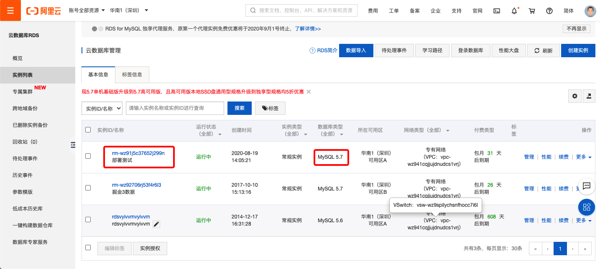
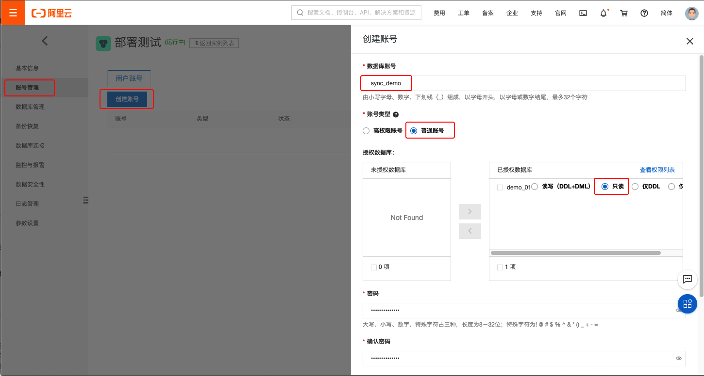
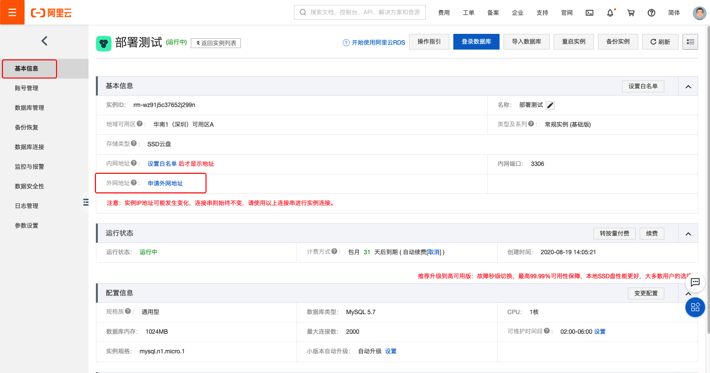
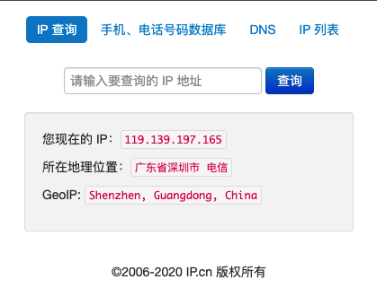
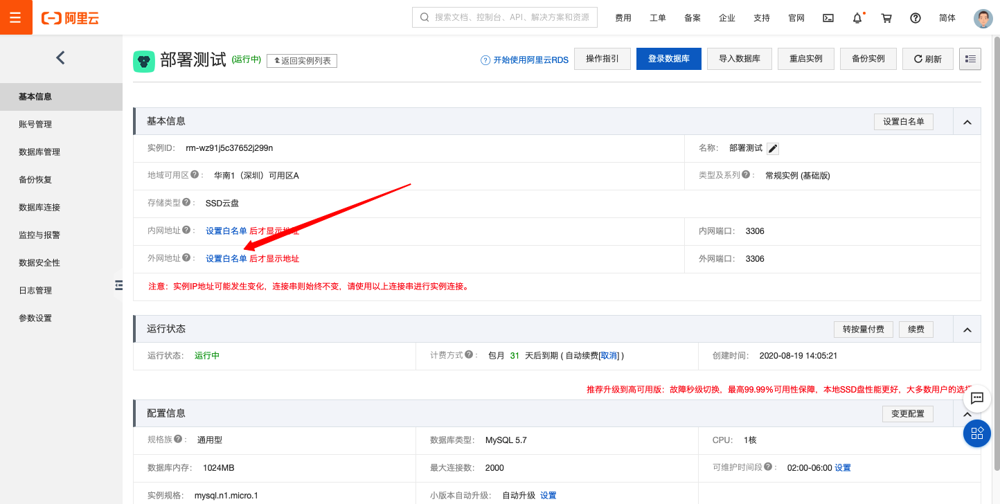
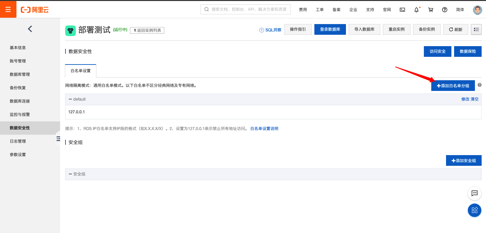
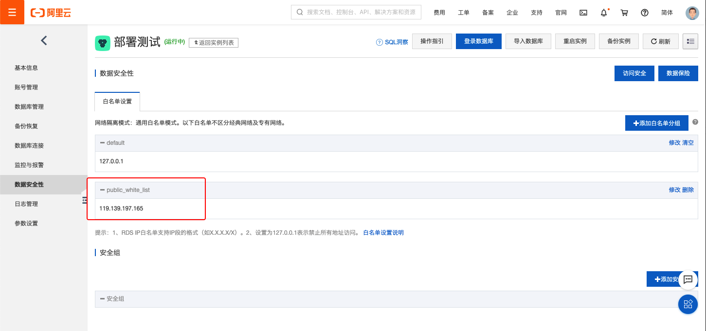
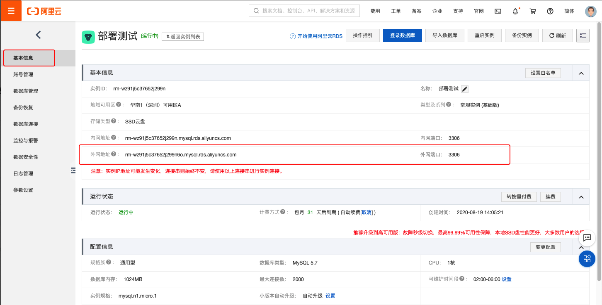
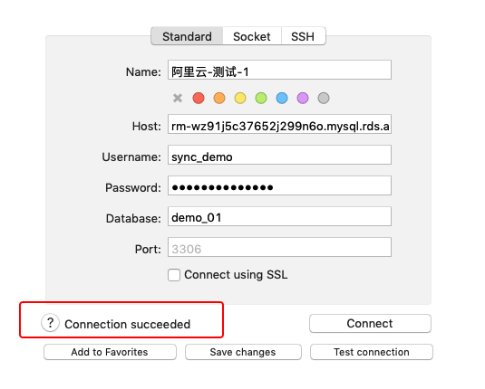

# 数据库主从配置

在东财的机房, 配置一台MySql 服务器, 作为掘金阿里云上生产数据库的只读从库

## demo方案搭建和配置过程

### 准备环境

* 在阿里云上申请一台 RDS 实例, 在demo里, 该数据库代指线上的生产数据库

  

  > * **注1** : 用于demo的数据库的版本类型与生产库保持一致 **MySQL 5.7**

* 在RDS的 **数据库管理**, 创建用于demo的测试数据库 **demo_01**

* 创建一个数据库只读账号, 用于从数据从主数据库同步数据

  

  * 数据账号名称: sync_demo

  * 账号类型: 普通类型

  * 密码: showmethemoney

  * 赋予权限. 

    * 首先查看 **sync_demo** 账号的 user 和 host

    ```sql
    mysql> use mysql;
    Database changed
    mysql> select user, host from user;
    +-------------+-----------+
    | user        | host      |
    +-------------+-----------+
    | dbadmin     | %         |
    | myadmin     | %         |
    | rds_service | %         |
    | sync_demo   | %         |
    | aliyun_root | 127.0.0.1 |
    +-------------+-----------+
    5 rows in set (0.01 sec)
    ```

    * 为账号 **sync_demo** 赋予数据复制权限

    ```sql
    mysql> grant replication slave on *.* to 'sync_demo'@'%' identified by 'showmethemoney';
    mysql> flush privileges;
    ```

  * 检查主库上GTID是否开启

    > **gtid_mode** 应该为 **ON**

    ```sql
    mysql> show variables like '%gtid%';
    +----------------------------------+----------------------------------------------+
    | Variable_name                    | Value                                        |
    +----------------------------------+----------------------------------------------+
    | binlog_gtid_simple_recovery      | ON                                           |
    | enforce_gtid_consistency         | ON                                           |
    | gtid_executed_compression_period | 1000                                         |
    | gtid_mode                        | ON                                           |
    | gtid_next                        | AUTOMATIC                                    |
    | gtid_owned                       |                                              |
    | gtid_purged                      | 57021fa0-e1e2-11ea-8adf-00163e128736:1-13720 |
    | opt_rds_last_error_gtid          | ON                                           |
    | rds_push_gtid_default_interval   | 10                                           |
    | session_track_gtids              | OFF                                          |
    +----------------------------------+----------------------------------------------+
    10 rows in set (0.01 sec)
    ```
    
  * 查看服务器server_uuid
  
    ```sql
    mysql> show global variables like 'server_uuid';
    +---------------+--------------------------------------+
    | Variable_name | Value                                |
    +---------------+--------------------------------------+
  | server_uuid   | 57021fa0-e1e2-11ea-8adf-00163e128736 |
    +---------------+--------------------------------------+
  1 row in set (0.01 sec)
    ```
  
  * 查看主服务器状态
  
    ```sql
    mysql> show master status \G
    *************************** 1. row ***************************
                 File: mysql-bin.000011
             Position: 427388
       Binlog_Do_DB:
     Binlog_Ignore_DB:
  Executed_Gtid_Set: 57021fa0-e1e2-11ea-8adf-00163e128736:1-25652
    1 row in set (0.01 sec)
    
    mysql>
    ```
  
  * 查看系统表 mysql 字符集. 主从库应该保持一致
  
    ```
  mysql> SHOW CREATE DATABASE mysql;
    +----------+----------------------------------------------------------------+
    | Database | Create Database                                                |
    +----------+----------------------------------------------------------------+
  | mysql    | CREATE DATABASE `mysql` /*!40100 DEFAULT CHARACTER SET utf8 */ |
    +----------+----------------------------------------------------------------+
  1 row in set (0.00 sec)
    ```
    
  * 查看服务器版本, 主从数据库保持版本一致. 如下所示, 查询出来的版本是 5.7.28
  
    > 注: 不同的 RDS 实例, 版本是会不一样的
  
    ```
    mysql> show variables like '%version%';
    +-------------------------+-----------------------+
    | Variable_name           | Value                 |
    +-------------------------+-----------------------+
  | innodb_version          | 5.7.28                |
    | protocol_version        | 10                    |
  | rds_audit_log_version   | MYSQL_V1              |
    | rds_version             | 28                    |
    | slave_type_conversions  |                       |
    | tls_version             | TLSv1,TLSv1.1,TLSv1.2 |
    | version                 | 5.7.28-log            |
    | version_comment         | Source distribution   |
    | version_compile_machine | x86_64                |
    | version_compile_os      | Linux                 |
    +-------------------------+-----------------------+
    10 rows in set (0.01 sec)
    ```
    
  * 确认二进制日志已经开启
  
    >  **log_bin** 应该为 **ON**
  
    ```sql
    mysql> show global variables like '%log_bin%';
    +---------------------------------+-------------------------------------------------+
    | Variable_name                   | Value                                           |
    +---------------------------------+-------------------------------------------------+
  | log_bin                         | ON                                              |
    | log_bin_basename                | /home/mysql/data3001/mysql/mysql-bin            |
  | log_bin_index                   | /home/mysql/data3001/mysql/master-log-bin.index |
    | log_bin_trust_function_creators | ON                                              |
    | log_bin_use_v1_row_events       | ON                                              |
    +---------------------------------+-------------------------------------------------+
    5 rows in set (0.00 sec)
    ```


  ​    

* 申请外网地址

  

  > 因为是跨公网访问, 所以需要申请外网地址

* 在 http://ip.cn 查询办公网络的外网IP地址

  

  查询可知, 办公外网 IP: 119.139.197.165

* 将办公网络外网IP加入到 **白名单**

  

  

  

* 查看外网访问地址信息

  

* 在本地电脑验证是否可以正常访问

  


### 创建从数据库

我们在本地创建一个 mysql@5.7 的docker实例来作为从数据库

> mysql 镜像使用参考: https://hub.docker.com/_/mysql

* 获取镜像, 注意, 获取与RDS一致的版本, 此处为 5.7.28

  ```bash
  docker pull mysql:5.7.28
  ```
  
* [镜像使用说明](https://hub.docker.com/_/mysql?tab=description&page=1&name=5.7)

* 创建一个目录用来存放 mysql 的配置文件, 假设目录为: /my/custom

* 创建容器实例

  ```bash
  docker run --name=demo-mysql -p 3306:3306 \
  -v /my/custom:/etc/mysql/conf.d \
  -e 'MYSQL_ROOT_PASSWORD=showmethemoney' \
  -e 'MYSQL_ROOT_HOST=%' \
  -d mysql:5.7.28
  
  # kk mac 下的创建命令
  docker run --name demo-mysql -p 3306:3306 \
  -v /Users/kk/work/tmp/mysql_conf.d:/etc/mysql/conf.d \
  -e MYSQL_ROOT_PASSWORD=showmethemoney \
  -e MYSQL_ROOT_HOST=% \
  -d mysql:5.7.28
  ```

* 在 /my/custom 目录下创建一个名称为 replication.cnf 的 msyql 配置文件

  ```
  [mysqld]
  character_set_server=utf8
  collation-server=utf8_general_ci
  
  server-id=666
  gtid_mode=ON
  enforce_gtid_consistency=ON
  log_slave_updates=1
  
  #设置要同步的库名称
  replicate-do-db=demo_01
  
  #设置不要同步的库名称,在此,不要同步系统库
  replicate-ignore-db=mysql
  ```
  
* 重启 mysql docker 实例

  ```bash
  docker restart demo-mysql
  ```
  
* 检查系统表 mysql 的字符集是否是 utf8

  ```sql
  mysql> use mysql
  Reading table information for completion of table and column names
  You can turn off this feature to get a quicker startup with -A
  
  Database changed
  mysql> SHOW CREATE DATABASE mysql;
  +----------+----------------------------------------------------------------+
  | Database | Create Database                                                |
  +----------+----------------------------------------------------------------+
  | mysql    | CREATE DATABASE `mysql` /*!40100 DEFAULT CHARACTER SET utf8 */ |
  +----------+----------------------------------------------------------------+
  1 row in set (0.00 sec)
  ```

### 备份主库

* 在本地创建一个 ubuntu 18.04 的docker实例, 运行 mysqldump 进行备份和恢复

  > * docker 实例创建过程略

  ```bash
  apt-get install -y pv 
  ```

* 备份数据

  ```bash
  mysqldump -usync_demo -pshowmethemoney --host=rm-wz91j5c37652j299n6o.mysql.rds.aliyuncs.com --hex-blob --master-data=2 --triggers --events --routines --databases demo_01 > gm3-backup.sql
  ```

### 恢复数据到从库

* 恢复数据

  ```bash
  # 192.168.0.141 为本地测试环境的数据库的IP地址
  pv gm3-backup.sql | mysql -uroot -pshowmethemoney --host=192.168.0.141
  ```

### 建立主从复制关系

* 从库连接到主库

  * 在从库上执行如下的命令.
  
  ```sql
  CHANGE MASTER TO MASTER_HOST='rm-wz91j5c37652j299n6o.mysql.rds.aliyuncs.com', MASTER_USER='sync_demo', MASTER_PASSWORD='showmethemoney', MASTER_AUTO_POSITION=1;

  ```
  
* 查看从库状态

  > 此时, **Slave_IO_Running** 和 **Slave_SQL_Running** 都还是 NO, 后面我们会执行命令, 启动slave

  ```
  mysql> show slave status \G
  *************************** 1. row ***************************
                 Slave_IO_State:
                    Master_Host: rm-wz91j5c37652j299n6o.mysql.rds.aliyuncs.com
                    Master_User: sync_demo
                    Master_Port: 3306
                  Connect_Retry: 60
                Master_Log_File:
            Read_Master_Log_Pos: 4
                 Relay_Log_File: 7e258555d176-relay-bin.000001
                  Relay_Log_Pos: 4
          Relay_Master_Log_File:
               Slave_IO_Running: No
              Slave_SQL_Running: No
                Replicate_Do_DB: demo_01
            Replicate_Ignore_DB: mysql
             Replicate_Do_Table:
         Replicate_Ignore_Table:
        Replicate_Wild_Do_Table:
    Replicate_Wild_Ignore_Table:
                     Last_Errno: 0
                     Last_Error:
                   Skip_Counter: 0
            Exec_Master_Log_Pos: 0
                Relay_Log_Space: 154
                Until_Condition: None
                 Until_Log_File:
                  Until_Log_Pos: 0
             Master_SSL_Allowed: No
             Master_SSL_CA_File:
             Master_SSL_CA_Path:
                Master_SSL_Cert:
              Master_SSL_Cipher:
                 Master_SSL_Key:
          Seconds_Behind_Master: NULL
  Master_SSL_Verify_Server_Cert: No
                  Last_IO_Errno: 0
                  Last_IO_Error:
                 Last_SQL_Errno: 0
                 Last_SQL_Error:
    Replicate_Ignore_Server_Ids:
               Master_Server_Id: 0
                    Master_UUID:
               Master_Info_File: /var/lib/mysql/master.info
                      SQL_Delay: 0
            SQL_Remaining_Delay: NULL
        Slave_SQL_Running_State:
             Master_Retry_Count: 86400
                    Master_Bind:
        Last_IO_Error_Timestamp:
       Last_SQL_Error_Timestamp:
                 Master_SSL_Crl:
             Master_SSL_Crlpath:
             Retrieved_Gtid_Set:
              Executed_Gtid_Set: 57021fa0-e1e2-11ea-8adf-00163e128736:1-39630
                  Auto_Position: 1
           Replicate_Rewrite_DB:
                   Channel_Name:
             Master_TLS_Version:
  1 row in set (0.00 sec)
  ```

* 启动 slave

  ```
  mysql> start slave;
  Query OK, 0 rows affected (0.01 sec)
  ```

* 再次检查 slave 的状态

  > **Slave_IO_Running** 和 **Slave_SQL_Running** 都为 **YES** 则表明, 数据复制服务以及运行起来了

  ```
  mysql> show slave status \G
  *************************** 1. row ***************************
                 Slave_IO_State: Waiting for master to send event
                    Master_Host: rm-wz91j5c37652j299n6o.mysql.rds.aliyuncs.com
                    Master_User: sync_demo
                    Master_Port: 3306
                  Connect_Retry: 60
                Master_Log_File: mysql-bin.000016
            Read_Master_Log_Pos: 313479
                 Relay_Log_File: 7e258555d176-relay-bin.000002
                  Relay_Log_Pos: 10393
          Relay_Master_Log_File: mysql-bin.000016
               Slave_IO_Running: Yes
              Slave_SQL_Running: Yes
                Replicate_Do_DB: demo_01
            Replicate_Ignore_DB: mysql
             Replicate_Do_Table:
         Replicate_Ignore_Table:
        Replicate_Wild_Do_Table:
    Replicate_Wild_Ignore_Table:
                     Last_Errno: 0
                     Last_Error:
                   Skip_Counter: 0
            Exec_Master_Log_Pos: 313479
                Relay_Log_Space: 10607
                Until_Condition: None
                 Until_Log_File:
                  Until_Log_Pos: 0
             Master_SSL_Allowed: No
             Master_SSL_CA_File:
             Master_SSL_CA_Path:
                Master_SSL_Cert:
              Master_SSL_Cipher:
                 Master_SSL_Key:
          Seconds_Behind_Master: 0
  Master_SSL_Verify_Server_Cert: No
                  Last_IO_Errno: 0
                  Last_IO_Error:
                 Last_SQL_Errno: 0
                 Last_SQL_Error:
    Replicate_Ignore_Server_Ids:
               Master_Server_Id: 2265194561
                    Master_UUID: 57021fa0-e1e2-11ea-8adf-00163e128736
               Master_Info_File: /var/lib/mysql/master.info
                      SQL_Delay: 0
            SQL_Remaining_Delay: NULL
        Slave_SQL_Running_State: Slave has read all relay log; waiting for more updates
             Master_Retry_Count: 86400
                    Master_Bind:
        Last_IO_Error_Timestamp:
       Last_SQL_Error_Timestamp:
                 Master_SSL_Crl:
             Master_SSL_Crlpath:
             Retrieved_Gtid_Set: 57021fa0-e1e2-11ea-8adf-00163e128736:39631-39664
              Executed_Gtid_Set: 57021fa0-e1e2-11ea-8adf-00163e128736:1-39664
                  Auto_Position: 1
           Replicate_Rewrite_DB:
                   Channel_Name:
             Master_TLS_Version:
  1 row in set (0.00 sec)
  ```

### 验证数据复制功能正常

* 我们已经在 RDS 的 demo_01 库上创建了样例数据

* 在 RDS 上查询数据

  ```
  mysql> use demo_01;
  Reading table information for completion of table and column names
  You can turn off this feature to get a quicker startup with -A
  
  Database changed
  mysql> select * from employees where employeeNumber = 1002;
  +----------------+----------+-----------+-----------+--------------------+------------+-----------+-----------+
  | employeeNumber | lastName | firstName | extension | email              | officeCode | reportsTo | jobTitle  |
  +----------------+----------+-----------+-----------+--------------------+------------+-----------+-----------+
  |           1002 | Myquant  | Diane     | x5800     | dmurphy@yiibai.com | 1          |      NULL | President |
  +----------------+----------+-----------+-----------+--------------------+------------+-----------+-----------+
  1 row in set (0.00 sec)
  ```

* 在本地从数据库上查询数据, 与RDS上的数据对比一致性

  ```
  mysql> use demo_01;
  Reading table information for completion of table and column names
  You can turn off this feature to get a quicker startup with -A
  
  Database changed
  mysql> select * from employees where employeeNumber = 1002;
  +----------------+----------+-----------+-----------+--------------------+------------+-----------+-----------+
  | employeeNumber | lastName | firstName | extension | email              | officeCode | reportsTo | jobTitle  |
  +----------------+----------+-----------+-----------+--------------------+------------+-----------+-----------+
  |           1002 | Myquant  | Diane     | x5800     | dmurphy@yiibai.com | 1          |      NULL | President |
  +----------------+----------+-----------+-----------+--------------------+------------+-----------+-----------+
  1 row in set (0.00 sec)
  ```

* 在 RDS 上更新数据

  ```
  mysql> update employees set lastName = 'Google' where employeeNumber = 1002;
  Query OK, 1 row affected (0.01 sec)
  Rows matched: 1  Changed: 1  Warnings: 0
  ```

* 在本地从数据库上查询数据, 与RDS上的数据对比一致性

  ```
  mysql> select * from employees where employeeNumber = 1002;
  +----------------+----------+-----------+-----------+--------------------+------------+-----------+-----------+
  | employeeNumber | lastName | firstName | extension | email              | officeCode | reportsTo | jobTitle  |
  +----------------+----------+-----------+-----------+--------------------+------------+-----------+-----------+
  |           1002 | Google   | Diane     | x5800     | dmurphy@yiibai.com | 1          |      NULL | President |
  +----------------+----------+-----------+-----------+--------------------+------------+-----------+-----------+
  1 row in set (0.01 sec)
  ```

### 验证从数据库重启

* stop 从数据库

  ```bash
  docker stop demo-mysql
  ```

* 在 RDS 上更新数据

  ```
  mysql> update employees set lastName = 'Facebook' where employeeNumber = 1002;
  Query OK, 1 row affected (0.00 sec)
  Rows matched: 1  Changed: 1  Warnings: 0
  ```

* start 从数据库

  ```
  docker start demo-mysql
  ```

* 验证:

  * 从数据库启动后, 能够自动进入数据复制

    > 检查 **Slave_IO_Running** 和 **Slave_SQL_Running** 的值为 **YES**

    ```
    mysql> show slave status \G
    *************************** 1. row ***************************
                   Slave_IO_State: Waiting for master to send event
                      Master_Host: rm-wz91j5c37652j299n6o.mysql.rds.aliyuncs.com
                      Master_User: sync_demo
                      Master_Port: 3306
                    Connect_Retry: 60
                  Master_Log_File: mysql-bin.000016
              Read_Master_Log_Pos: 370033
                   Relay_Log_File: 7e258555d176-relay-bin.000004
                    Relay_Log_Pos: 24916
            Relay_Master_Log_File: mysql-bin.000016
                 Slave_IO_Running: Yes
                Slave_SQL_Running: Yes
                  Replicate_Do_DB: demo_01
              Replicate_Ignore_DB: mysql
               Replicate_Do_Table:
           Replicate_Ignore_Table:
          Replicate_Wild_Do_Table:
      Replicate_Wild_Ignore_Table:
                       Last_Errno: 0
                       Last_Error:
                     Skip_Counter: 0
              Exec_Master_Log_Pos: 370033
                  Relay_Log_Space: 25170
                  Until_Condition: None
                   Until_Log_File:
                    Until_Log_Pos: 0
               Master_SSL_Allowed: No
               Master_SSL_CA_File:
               Master_SSL_CA_Path:
                  Master_SSL_Cert:
                Master_SSL_Cipher:
                   Master_SSL_Key:
            Seconds_Behind_Master: 0
    Master_SSL_Verify_Server_Cert: No
                    Last_IO_Errno: 0
                    Last_IO_Error:
                   Last_SQL_Errno: 0
                   Last_SQL_Error:
      Replicate_Ignore_Server_Ids:
                 Master_Server_Id: 2265194561
                      Master_UUID: 57021fa0-e1e2-11ea-8adf-00163e128736
                 Master_Info_File: /var/lib/mysql/master.info
                        SQL_Delay: 0
              SQL_Remaining_Delay: NULL
          Slave_SQL_Running_State: Slave has read all relay log; waiting for more updates
               Master_Retry_Count: 86400
                      Master_Bind:
          Last_IO_Error_Timestamp:
         Last_SQL_Error_Timestamp:
                   Master_SSL_Crl:
               Master_SSL_Crlpath:
               Retrieved_Gtid_Set: 57021fa0-e1e2-11ea-8adf-00163e128736:39631-39856
                Executed_Gtid_Set: 57021fa0-e1e2-11ea-8adf-00163e128736:1-39856
                    Auto_Position: 1
             Replicate_Rewrite_DB:
                     Channel_Name:
               Master_TLS_Version:
    1 row in set (0.00 sec)
    ```

  * 从数据库的数据, 同步更新到最新 (将停机这段时间内, 主库的更新同步到本地)

    ```
    mysql> select * from employees where employeeNumber = 1002;
    +----------------+----------+-----------+-----------+--------------------+------------+-----------+-----------+
    | employeeNumber | lastName | firstName | extension | email              | officeCode | reportsTo | jobTitle  |
    +----------------+----------+-----------+-----------+--------------------+------------+-----------+-----------+
    |           1002 | Facebook | Diane     | x5800     | dmurphy@yiibai.com | 1          |      NULL | President |
    +----------------+----------+-----------+-----------+--------------------+------------+-----------+-----------+
    1 row in set (0.00 sec)
    
    ```


## 参考资料

* [MySql 5.7 中文文档](https://www.docs4dev.com/docs/zh/mysql/5.7/reference)
* [MySql 5.7 主从复制]([https://www.docs4dev.com/docs/zh/mysql/5.7/reference/replication.html#%E5%A4%8D%E5%88%B6](https://www.docs4dev.com/docs/zh/mysql/5.7/reference/replication.html#复制))
* [使用 Global Transaction 标识符进行复制](https://www.docs4dev.com/docs/zh/mysql/5.7/reference/replication-gtids.html)
* [MySQL 5.7 基于 GTID 的主从复制实践](https://www.hi-linux.com/posts/47176.html)
* [replicate-do-db 参数配置](https://dev.mysql.com/doc/refman/5.7/en/replication-options-replica.html#option_mysqld_replicate-do-db)
* [replicate-ignore-db 参数配置](https://dev.mysql.com/doc/refman/5.7/en/replication-options-replica.html#option_mysqld_replicate-ignore-db)
* [[MySQL mysqldump数据导出详解](https://www.cnblogs.com/zengkefu/p/5690195.html)]
* [Show mysqldump progress using pv](https://mozinc.wordpress.com/2017/05/25/show-mysqldump-progress-using-pv/)

